# この文章について
## これは何か
- MMDモデルをシド星にユニットとして召喚してみる
- civ4のModdingをやったことある人向け
- Blender・3Dモデリングの予備知識は必要ないように書いているつもり

## これは何でないか
- 今はまだこけし状態での召喚のみで、動かすことは出来ない
- 指導者画面/都市改善に使用される3Dモデルのことは未調査
- 筆者は3Dモデルに精通していないためスマートなやり方ではない可能性が高い

# 用意するもの
## Blender

<http://www.blender.org/download/>
最新版(執筆時点では2.76bですが、それより多少新しくてもたぶん大丈夫)
を取ってきて、普通にインストールします。
addon用のディレクトリは
(Blenderのインストールパス)\(バージョン番号)\scripts\addons
なので、基本的にここに追加のaddonを入れていきます。

## blender_nif_plugin
<https://www.dropbox.com/sh/b8pl4kxbdjtbfit/AABU7srXHWCGB49gEIVGcYkja?dl=0>
「blender_nif_plugin-2.6.0a0.dev4-01.04.15.zip」のzipを取ってきて展開します。
中のio_scene_nif\texturesys\texture_export.pyの427行目あたり、
shadername = self.EXTRA_SHADER_TEXTURES[shaderindex]
とあるところを
shadername = self.nif_export.EXTRA_SHADER_TEXTURES[shaderindex]
に変えます。その後、addonsディレクトリにio_scene_nifをディレクトリごとコピーします。

## blender_mmd_tools

<https://github.com/sugiany/blender_mmd_tools/tags>
最新版を取ってきて(執筆時点では0.4.5)、
中のmmd_toolsをaddonsディレクトリにコピーします。

## Nifskope
<http://sourceforge.net/projects/niftools/files/nifskope/1.1.3/>
最新版を取ってきて、普通にインストールします。

## GIMP＆DDS Plugin
<http://semakimomo.net/post-022/>
このページ通りにインストールすれば多分大丈夫です。
画像ファイルを縮小＆.dds形式に変換するのに使うだけなので、
使い慣れている画像編集ソフトで.dds形式を扱える物をお持ちなら、
そちらを使ってももちろん構いません。

## モデル
<http://3d.nicovideo.jp/works/td14712>
この文章ではニコニ立体ちゃんにモデルをお願いします。
普通に取ってきてお好きなところへ展開しておきます。

# モデルを読み込んでみる
Blenderを起動してみましょう。
真ん中に立方体と、ボタンがたくさん出てきます。

{:width="960" height="500"}

File - User Preferences から設定画面を出して、Add-onsタブを選択、
ここまで上手くいっていれば、検索窓に「mmd」と入れるとObject: mmd_toolsが見つかるはずなので、
チェックボックスをオンにして有効化します。

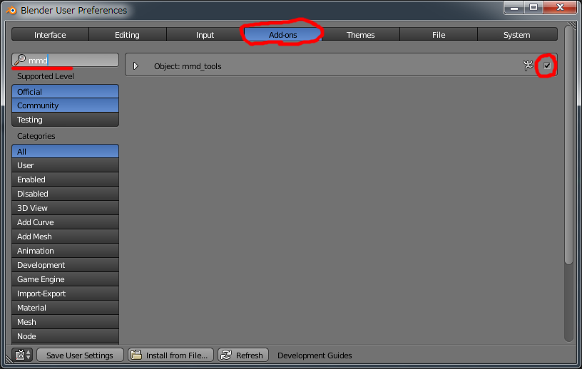{:width="816" height="518"}

同じように、「nif」で検索して、Import-Export: NetImmerse/Gamebryo nif formatを有効化しておきます。
BlenderのAddonは入れただけでは有効にならず、このように明示的に有効化しないと使えないので注意しておきます。

タブをSystemに戻して、InternationalFontsをオンにしておきます。
近くにあるLanguageでメニューの日本語化も出来ますが、
日本語で読めるほとんどのBlender記事は英語メニュー名を前提としていて、
この文書でも英語のメニュー名で説明するため、そのままでよいです。

{:width="816" height="518"}

MMDタブ - Import: ModelからさっそくMMDモデルを読み込んでみます。

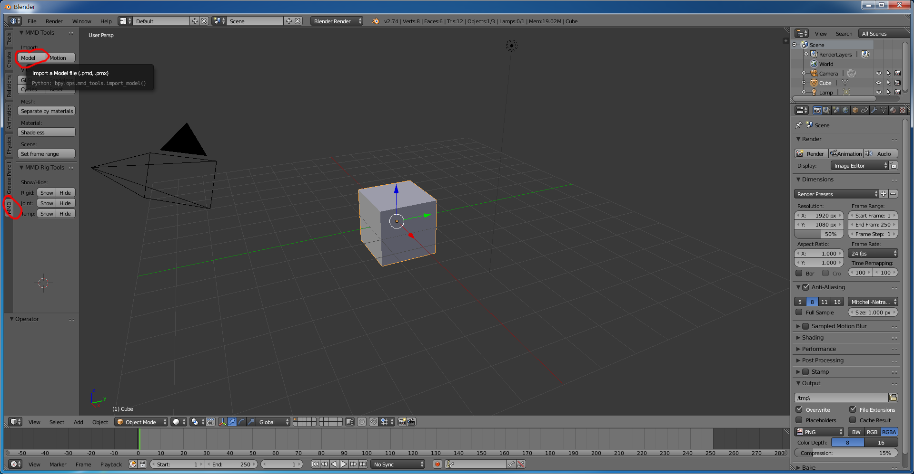{:width="960" height="500"}

インポートのオプションは

- scale: 0.20
- rename bonesオン
- hide regid bodies and jointsオフ
- import only non dynamics rigid bodiesオン
- ignore non collision groupsオン

にしておきます。

{: width="960" height="500"}

ここまで上手くいっていれば、中央のビューに真っ白のモデルが出てくるはずです。
これは色が読み込まれていないのではなく、表示されていないだけなので、
View: GLSLを押して色を出しておきます。

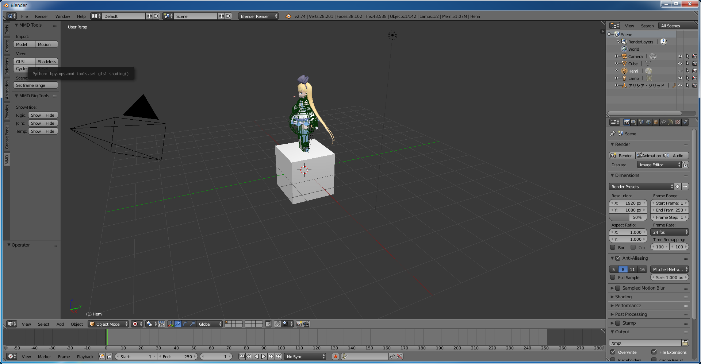{: width="960" height="500"}

## 眺める
ここまで出来たら、Blenderの操作練習をかねて眺め回してみましょう。

- **マウスの中ボタンをドラッグ**で回転できます。
- **テンキーの2,4,6,8**でその方向にすこし回転できます。
- **テンキーの1**で真正面・**テンキーの3**で真横(右から)・**テンキーの7**で真上の視点に移動できます。
- **右クリック**でオブジェクトを選択できます。

# モデル本体以外のデータを削除する
## まずここまで保存
この文章の目的は「とりあえずシド星に出してみる」ことなので、これから最低限のデータ以外を削ぎ落としていきます。
なので、この章を始める前にここまでの作業を、「Ctrl+S」で保存しておきます。
このとき、『mmxと同じフォルダに』blendファイルを置いてください。

## 消す練習
まず、デフォルトのキューブが邪魔なので消します。
右クリックでキューブを選択、**[X]**を押します。

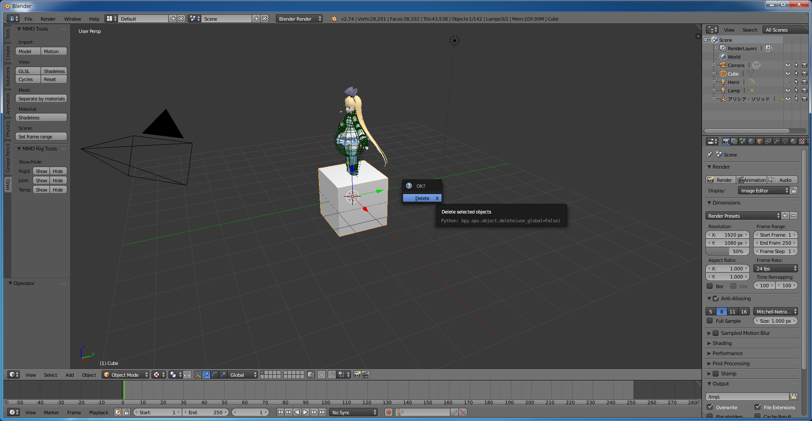{: width="960" height="500"}

すると、本当に消してもいいかツールチップが出るので、Deleteをクリックします。
Blenderでは、このように「オブジェクトを選択→１文字のショートカットキー」で操作、という操作をよく使います。
この要領で動かすための関節や表情のデータを全部消し、外形のデータだけを残すのですが、
MMDのモデルをただインポートしただけの状態ではデータ数があまりにも多すぎてめんどくさいため、
この文章では「外形だけ別レイヤーに待避しておき、残ったものを全選択して消す」という方法をとります。

## 一気に消す
その外形のデータは
Outliner - アリシア・ソリッド - アリシア・ソリッド_arm - アリシア・ソリッド_mesh
にあるので、順に選択していき、

{: width="960" height="500"}

Propaties - Object - Layers から別のレイヤーを選択します。

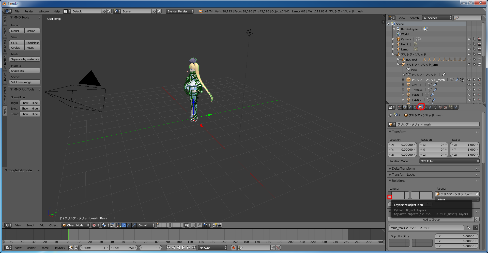{: width="960" height="500"}

メッシュだけ別レイヤーに行きました。
「今見ているレイヤー」は、下の方のVisible Layersで切り替えられます。ぽちぽちしてみると、
メッシュとその他に分かれていることがわかります。

{: width="960" height="500"}

Visible Layersを左上に戻して、**[A]**で全選択、**[X]**で削除します。

## ゴミが残っているので消す
これで全部消えたように見えますが、見えてないオブジェクトは消えてないので、
目のマークをクリックして見えるようにして、選択して、**[X]**で消します。
(通常、この作業をする必要があるのはncc_rootというオブジェクトだけです。もし他にも見えないオブジェクトが残っているなら、これまでのどこか(特にインポートの際のオプション)で間違っている可能性があります。)

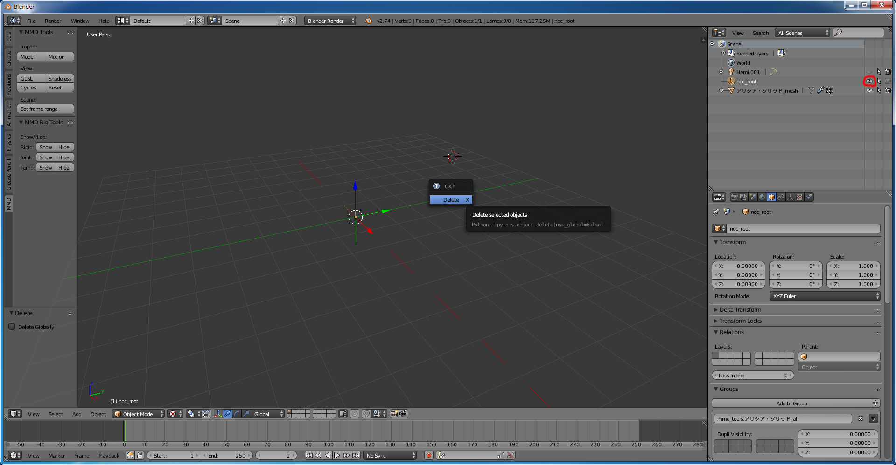{: width="960" height="500"}

## 表情/ポーズ差分を消す
レイヤーをモデルの方に移して、表情/ポーズ差分を消します。
Propaties - Data - Shapesにある逆三角からDelete All Shapesを選びます。

{: width="960" height="500"}

# テクスチャ設定をいじる

この章ではテクスチャをnif形式で読めるようにしていきます。

Outlinerからアリシア・ソリッド_mesh - アリシア・ソリッドと展開していくと、
部位っぽい名前がついた丸がたくさん出てきます。
これは各部位の色塗り設定のようなもので、ひとつひとつをMaterialと呼んでいます。
Materialには本体の画像データたるTextureのほかに、貼り付け方式や光沢・透過などの情報も含まれるのですが、
nif形式では、各Materialに1つのテクスチャをUV-map形式で貼り付けることしかできないので、1番目以外は消していきます。

「Outlinerから各Materialの2番目のテクスチャを選択し、Propaties - Texture - ×マークで消す」
作業を複数のTextureを持っている全Materialに対してぽちぽちとやっていきます。

{: width="960" height="500"}

(全Materialについてぽちぽち中・・・)

さらに各Materialの1番目のTextureに対してMapping - Map - UVMapを設定していきます。

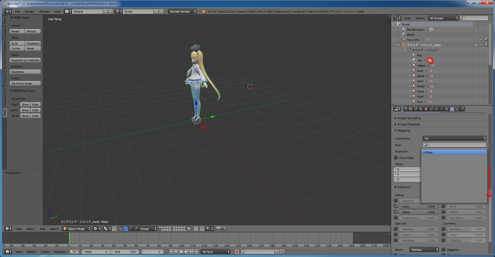{: width="960" height="500"}

(全Materialについてぽちぽち中・・・)

# 出力する
Propaties - Object - Niftools - Niftools Object Panel - NifVersionから
nif形式としてのバージョンを自己申告します。BtS用だと20.0.0.4にするのが安定のようです。

ここまでの作業を、『mmxと同じフォルダに』blendファイルとしていったん保存します。
最初に保存した物とは別名にしておくのが良いでしょう。

さて、nifを作ります。
**必ずモデルを[A]で全選択してから、**
メニューからFile - Export - NetImmerse/Gavebryo(.nif)を選んで、

{: width="960" height="500"}

オプションを

- Scale Correction Export: 30
- Game: Civilization IV
- Process: Geometry only(nif)
- Smooth Inter-Object-Seams: オフ
- Use NiBSAnimationNode: オフ
- Flatten Skin: オフ
- Skin Partition: オフ
- Pad & Sort Bones: オフ
- **Force DDS: オン**

にして、いざ出力！

{: width="300" height="368"}

うまくいっていると、マテリアルを統合したというWarningがたくさん出て、nifファイルができます。

# NifSkope
できたnifファイルをNifSkopeで開いてみます。

{: width="648" height="407"}

はい。なにもありません。
・・・もとい見えてないだけです。
階層をたどっていってNiMaterialProperty(パレットのアイコン)のところで、
Alpha(不透明度)が<small>なぜか</small>0(完全透明)になっているので、1(完全不透明)に直します。

{: width="648" height="407"}

見えました。必要なら他の各NiTriShapeでもNiMaterialProperty - Alphaの修正をしますが、
この例のモデルではNiMaterialPropertyが統合されてしまっているので、１カ所修正しただけで上手く動くようです。
この時点では色が真っ白ですが、これはciv4で使われている画像形式とMMDで使われている画像形式が異なるためです。
うまく貼り付けられるように、.tgaファイルを.dds形式に変換してあげる必要があります。

その前にとりあえず、Alpha値を修正したものを alicia2.nif という名前で保存しておきます。

# テクスチャ画像の変換
GIMPを使って、テクスチャ画像を.dds形式に変換していきます。
.tgaファイルを開いて・・・ 

{: width="453" height="382"}

128*128に縮小して・・・

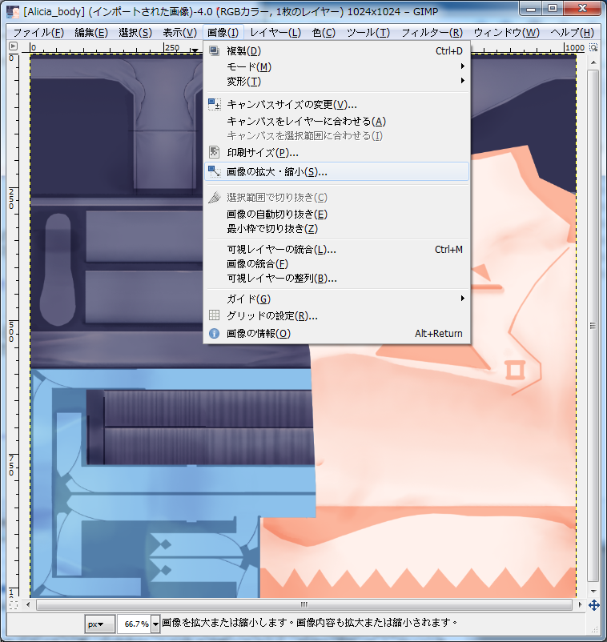{: width="379" height="401"}
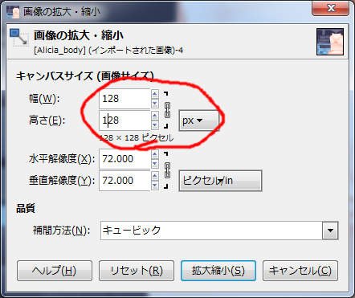{: width="221" height="185"}

.ddsとして出力。

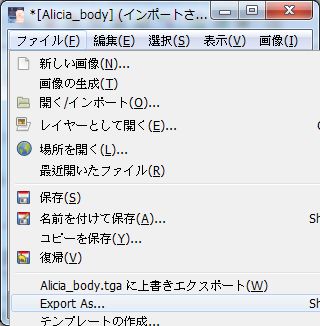{: width="320" height="326"}
{: width="453" height="382"}

これを、必要なファイルの分だけ繰り返します。(ぽちぽち・・・)
先だってテクスチャを削ったので、全ての.tga画像が必要なわけではありません。
NifSkope上でNodeを全部展開していくと、使われているファイル名がわかるので、使われているものだけでよいです。

{: width="483" height="705"}

.ddsが全部できたら、修正保存しておいたnifを開き直してみると、色がついていることがわかります。

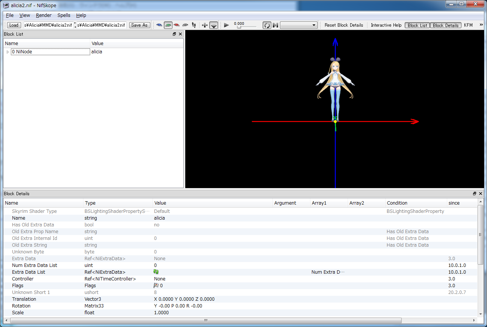{: width="648" height="435"}

#組み込む
お疲れ様でした！できたnifとddsをMODS\(MOD名)\assets\Art\Units\Alicia\にコピーして、
{: width="499" height="332"}
Civ4ArtDefines_Unit.xmlの ART_DEF_UNIT_LION(ライオン以外の挙動は未調査)の&lt;NIF&gt;と&lt;SHADERNIF&gt;の両方を
Art/Units/alicia/alicia2.nifに変えると・・・
(ちょっと大きいですが)MMDモデルがライオンとしてシド星に現れました(画像略)！Enjoy!

[第２章へ→](nifanimation.html)

# エラー出るんだけど
ここにあるエラーは手順を飛ばしてエラーになる場合なので、たぶん直せばうまくいきます。

ValueError: not enough values to unpack (expected 4, got 1) nif_ver_dec_1, nif_ver_dec_2, nif_ver_dec_3, nif_ver_dec_4 = dec_split
:    バージョンを入れてないかも。

AttributeError: 'Key' object has no attribute 'ipo'
:    Shapeを消し忘れていませんか？

AttributeError: 'TextureHelper' object has no attribute 'warning'
:    出力オプションを間違えている可能性があります。とくにいちど出力に成功しないかぎり設定は保存されませんので、失敗したらまたオプションを設定しなおしてください。

